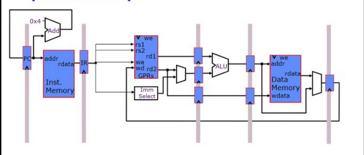

# RISC-V-Core
### This is an implamentation of a 32 bit RISC-V processor Core using Verilog HDL.

  
  
  ### Specifications -
  * Implemented a 32-bit multistage RISC-V processor core using Verilog HDL. 
  * Individually created modules like Instruction Fetc Units, Registers, Memory, ALU, Decoder of a processor.
  * Integrated these Individual modules to form a single working processor core.
  * Tools Used : iVerilog (version 11.0) , GTKWave
  
## RISC-V Pipeline 

  
  
## Execution Result
  

  
  
